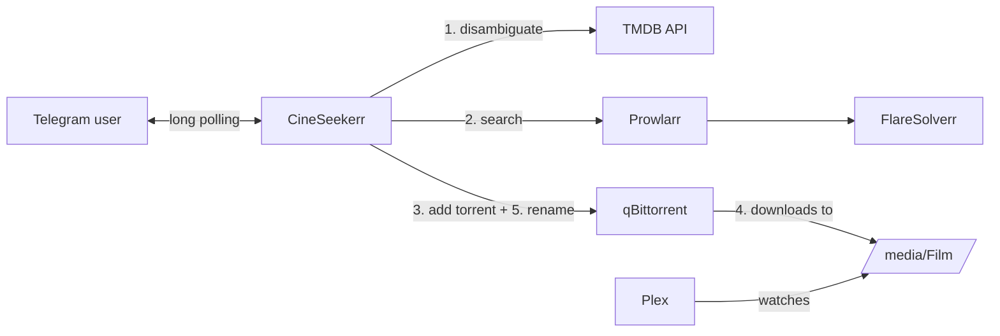

# 🍿 CineSeekerr

[](https://github.com/Emanuele-Patruno/cineseekerr/actions/workflows/ci.yml)
[](LICENSE)


A self-hosted Telegram bot that turns *"hey, let's watch Dune tonight"* into a movie
sitting in your Plex library — by chatting with it. It searches your
[Prowlarr](https://prowlarr.com/) indexers, lets you pick quality/audio/subtitles through
inline buttons, hands the torrent to [qBittorrent](https://www.qbittorrent.org/) and
renames the finished download so [Plex](https://www.plex.tv/) matches it perfectly.

No Radarr required — CineSeekerr talks Telegram instead of a web UI, in the same spirit as
the `*arr` family (Radarr, Sonarr, Prowlarr) it plugs into. Designed for a small home NAS
stack (built on a UGREEN DXP4800 Plus, but any Docker host works).

<p align="center">
  
  <br><em>(screenshot coming soon)</em>
</p>

## ✨ Features

- **Movie disambiguation via TMDB** — type a title (even the localized one), pick the
  right movie from up to 5 candidates with year and poster.
- **Smart release parsing** — resolution, audio languages (incl. Italian scene tags like
  `iTA-ENG`, `DLMux`, `BDMux`), subtitles (`SUB iTA`…), codec and source are extracted
  from every release name.
- **Dynamic filters, never a dead end** — filter buttons are built from the actual
  results (`Quality: [1080p (14)] [2160p (6)] [720p (3)]`); an option leading to zero
  results is never offered, and steps with a single option are skipped.
- **MULTI-aware language filtering** — picking *ITA* also includes `MULTI`/`DUAL`
  releases, which usually carry the Italian track.
- **Top-5 by seeders** — with size, indexer and parsed details, one tap to download.
- **Plex-ready renaming** — when the download completes the bot renames it to
  `Title (Year)` *through the qBittorrent API*, so seeding continues and the bot needs no
  access to the media volume.
- **Private by default** — a chat-ID whitelist; anyone else is silently ignored.
- **One clean message** — the bot edits a single message through the whole flow instead
  of spamming the chat.

## 🏗 Architecture



The conversation is a per-chat state machine (`bot/`), external services live behind thin
typed clients (`client/`), and the heart of the project is a pure, dependency-free release
name parser (`parser/`) with an extensive test suite.

```
src/main/java/com/cineseekerr/bot/
├── bot/        # state machine, filters, download watcher, Plex rename
├── client/     # TMDB, Prowlarr, qBittorrent (Spring RestClient)
├── config/     # typed configuration properties
├── model/      # records: releases, torrents, parsed attributes
└── parser/     # ReleaseNameParser — pure, no dependencies
```

## 🚀 Setup

### Prerequisites

A Docker host already running **Prowlarr** (with your indexers configured) and
**qBittorrent**, sharing a Docker network. Plex and FlareSolverr fit the picture but the
bot doesn't talk to them directly.

### 1. Create the Telegram bot

1. Open [@BotFather](https://t.me/BotFather) → `/newbot`, pick a name and username.
2. Save the **token** (`123456789:AAF...`).
3. Get your **chat ID** from [@userinfobot](https://t.me/userinfobot) (just send it any
   message).

### 2. Get the API keys

- **TMDB**: create an account on [themoviedb.org](https://www.themoviedb.org/), then
  *Settings → API*. Both the **v3 API Key** and the **v4 Read Access Token** work — the
  bot auto-detects which one you gave it.
- **Prowlarr**: *Settings → General → API Key*.

### 3. Deploy

Copy [docker-compose.yml](docker-compose.yml), fill in the environment variables, point
the `networks` section at the Docker network your media stack uses, then:

```bash
docker compose up -d
```

Send `/start` to your bot. Done.

## ⚙️ Configuration

Everything is configured through environment variables:

| Variable | Required | Default | Description |
|---|---|---|---|
| `TELEGRAM_BOT_TOKEN` | ✅ | — | Bot token from BotFather |
| `TELEGRAM_ALLOWED_CHAT_IDS` | ✅ | — | Comma-separated whitelist of chat IDs; all other chats are ignored |
| `TMDB_API_KEY` | ✅ | — | TMDB v3 API key **or** v4 Read Access Token |
| `TMDB_LANGUAGE` | | `it-IT` | Language for titles and plots shown in chat |
| `TMDB_BASE_URL` | | `https://api.themoviedb.org/3` | Override for proxies |
| `PROWLARR_URL` | ✅ | — | e.g. `http://prowlarr:9696` (container name on the shared network) |
| `PROWLARR_API_KEY` | ✅ | — | Prowlarr API key |
| `QBITTORRENT_URL` | ✅ | — | e.g. `http://qbittorrent:8080` |
| `QBITTORRENT_USER` | ✅ | — | qBittorrent WebUI username |
| `QBITTORRENT_PASS` | ✅ | — | qBittorrent WebUI password |
| `MEDIA_ROOT_FOLDER` | | `/volume1/media/Film` | Save path **as seen by the qBittorrent container** |
| `DOWNLOAD_POLL_INTERVAL` | | `PT30S` | How often to check for completed downloads (ISO-8601) |

## 💬 Commands

| Command | Effect |
|---|---|
| *any text* | Search that movie title |
| `/cerca <title>` | Same as typing the title |
| `/stato` | Progress of active downloads (%, speed, ETA), each with a button to stop it |
| `/annulla` | Cancel the current operation |
| `/help` | Command list |

## 🛠 Development

```bash
./mvnw verify          # build + full test suite
./mvnw spring-boot:run # run locally (reads the same env variables)
docker build -t cineseekerr .
```

The project intentionally keeps the parser (`ReleaseNameParser`) pure and framework-free:
if you want to improve scene-name coverage, that class plus its ~50-case test suite is
the only place to touch.

Notable test coverage: 130+ tests including the full conversation flow (mocked Telegram),
qBittorrent session expiry/re-login, dynamic filter invariants ("never offer a
zero-result option") and 45+ real-world release names.

## 🗺 Roadmap

- [ ] Redis-backed conversation state (interface already in place)
- [ ] Persist pending downloads across restarts
- [ ] TV series support
- [ ] Disk space check before downloading
- [ ] Optional per-user quality profiles
- [ ] English UI translation

## 📄 License

[MIT](LICENSE) — do whatever you want, no warranty.

> **Note**: this bot is a private automation tool for your own media stack. Make sure
> whatever you download complies with the laws of your country.
