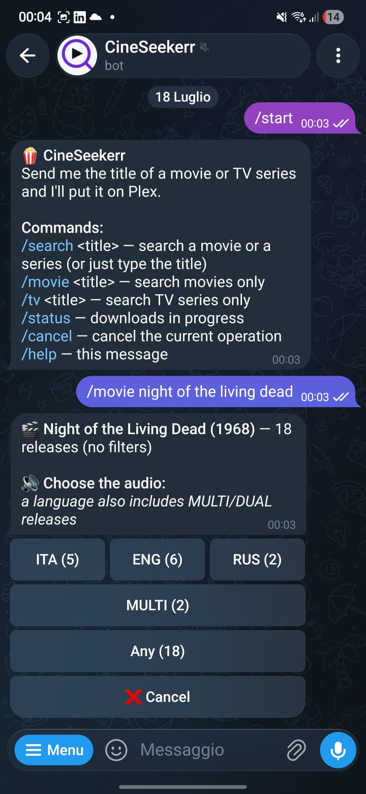
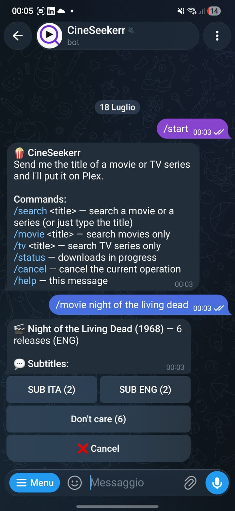
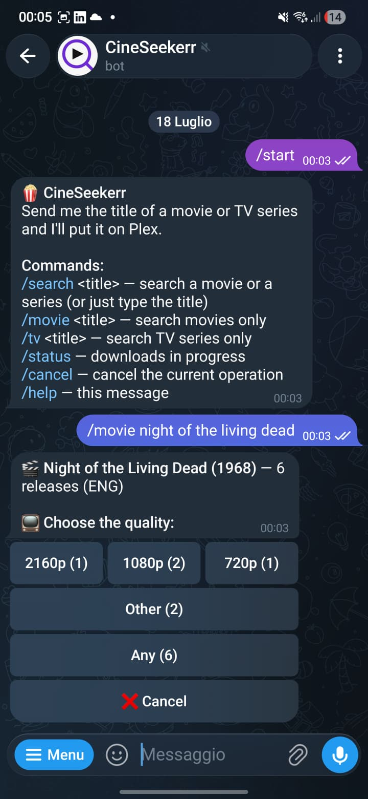
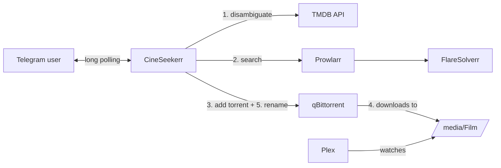

<p align="center">
  
</p>

# CineSeekerr

[](https://github.com/Emanuele-Patruno/cineseekerr/actions/workflows/ci.yml)
[](LICENSE)


A self-hosted media collection manager for [Plex](https://www.plex.tv/), driven entirely
by Telegram chat. It searches your [Prowlarr](https://prowlarr.com/) indexers, lets you
pick quality/audio/subtitles through inline buttons, hands the chosen release to your
download client ([qBittorrent](https://www.qbittorrent.org/)) and renames the finished
download so Plex matches it perfectly.

No Radarr required — CineSeekerr talks Telegram instead of a web UI, in the same spirit as
the `*arr` family (Radarr, Sonarr, Prowlarr) it plugs into. Designed for a small home NAS
stack, but any Docker host works.

<p align="center">
  
  
  
</p>

## ✨ Features

- **Movies and TV series in one search** — type a title (even the localized one) and pick
  from up to 5 TMDB candidates, movies 🎬 and series 📺 mixed, with year and poster.
- **Season packs and single episodes for TV** — pick the season, then either the whole
  season (only complete packs: `S01`, `Stagione 1 COMPLETA`, `S01E01-E10`…) or one
  specific episode (`S02E10`), perfect for series still airing. TMDB's season count can be
  wrong for some shows — a "type a different number" option is always there as an escape
  hatch.
- **Smart release parsing** — resolution, audio language, subtitles, codec and source
  are extracted from every release name, including common scene-naming conventions.
- **Dynamic filters, never a dead end** — filter buttons are built from the actual
  results (`Quality: [1080p (14)] [2160p (6)] [720p (3)]`); an option leading to zero
  results is never offered, and steps with a single option are skipped.
- **Language-aware filtering** — audio/subtitle buckets are built from the tags actually
  found in the results (ITA, ENG, FRE, GER, SPA, JAP, KOR, RUS, POR…), so picking a
  preferred audio and subtitle language is one tap away; picking a language also includes
  `MULTI`/`DUAL` releases, which usually carry it.
- **Speaks your language** — the bot's own messages are available in English and Italian
  (`BOT_LANGUAGE`), and it searches indexers with both the original and the localized
  title, merging the results.
- **Top-5 by seeders** — with size, indexer and parsed details, one tap to send it to
  your download client.
- **Downloads survive a restart** — in-flight downloads are mirrored to disk, so a
  container restart doesn't lose track of the Plex rename it still owes you.
- **Stalled-download detection** — a download stuck at 0 seeders for 2 hours gets a single
  notification with a button to stop it and search for another release.
- **Plex-ready renaming** — when the download completes the bot renames it *through the
  qBittorrent API* (movies to `Title (Year)`, seasons to `Show (Year)/Season NN`), so
  seeding continues and the bot needs no access to the media volume.
- **Private by default** — a chat-ID whitelist; anyone else is silently ignored.
- **One clean message** — the bot edits a single message through the whole flow instead
  of spamming the chat.

## 🏗 Architecture



The conversation is a per-chat state machine (`bot/`), external services live behind thin
typed clients (`client/`), and the heart of the project is a pure, dependency-free release
name parser (`parser/`) with an extensive test suite.

```
src/main/java/com/cineseekerr/bot/
├── bot/        # state machine, filters, download watcher, Plex rename
├── client/     # TMDB, Prowlarr, qBittorrent (Spring RestClient)
├── config/     # typed configuration properties
├── model/      # records: releases, torrents, parsed attributes
└── parser/     # ReleaseNameParser — pure, no dependencies
```

## 🚀 Setup

### Prerequisites

A Docker host already running **Prowlarr** (with your indexers configured) and
**qBittorrent**, sharing a Docker network. Plex and FlareSolverr fit the picture but the
bot doesn't talk to them directly.

### 1. Create the Telegram bot

1. Open [@BotFather](https://t.me/BotFather) → `/newbot`, pick a name and username.
2. Save the **token** (`123456789:AAF...`).
3. Get your **chat ID** from [@userinfobot](https://t.me/userinfobot) (just send it any
   message).

### 2. Get the API keys

- **TMDB**: create an account on [themoviedb.org](https://www.themoviedb.org/), then
  *Settings → API*. Both the **v3 API Key** and the **v4 Read Access Token** work — the
  bot auto-detects which one you gave it.
- **Prowlarr**: *Settings → General → API Key*.

### 3. Deploy

Copy [docker-compose.yml](docker-compose.yml), fill in the environment variables, point
the `networks` section at the Docker network your media stack uses, then:

```bash
docker compose up -d
```

Send `/start` to your bot. Done.

## ⚙️ Configuration

Everything is configured through environment variables:

| Variable | Required | Default | Description |
|---|---|---|---|
| `BOT_LANGUAGE` | | `en` | Language of the bot's own messages: `en` or `it` (PRs for more welcome) |
| `TELEGRAM_BOT_TOKEN` | ✅ | — | Bot token from BotFather |
| `TELEGRAM_ALLOWED_CHAT_IDS` | ✅ | — | Comma-separated whitelist of chat IDs; all other chats are ignored |
| `TMDB_API_KEY` | ✅ | — | TMDB v3 API key **or** v4 Read Access Token |
| `TMDB_LANGUAGE` | | follows `BOT_LANGUAGE` | Language for titles and plots shown in chat, e.g. `it-IT`; set explicitly to decouple it from the bot's own UI language |
| `TMDB_BASE_URL` | | `https://api.themoviedb.org/3` | Override for proxies |
| `PROWLARR_URL` | ✅ | — | e.g. `http://prowlarr:9696` (container name on the shared network) |
| `PROWLARR_API_KEY` | ✅ | — | Prowlarr API key |
| `QBITTORRENT_URL` | ✅ | — | e.g. `http://qbittorrent:8080` |
| `QBITTORRENT_USER` | ✅ | — | qBittorrent WebUI username |
| `QBITTORRENT_PASS` | ✅ | — | qBittorrent WebUI password |
| `MEDIA_ROOT_FOLDER` | ✅ | — | Movie save path **as seen by the qBittorrent container**, e.g. `/media/Movies` |
| `MEDIA_TV_ROOT_FOLDER` | ✅ | — | TV series save path (same rule), e.g. `/media/TV`; each season lands in `Show (Year)/Season NN` |
| `DOWNLOAD_POLL_INTERVAL` | | `PT30S` | How often to check for completed downloads (ISO-8601) |
| `DOWNLOAD_STATE_FILE` | | `/data/pending-downloads.json` | Where in-flight downloads are mirrored so a restart doesn't lose track of a pending Plex rename — mount a volume over its parent folder |

## 💬 Commands

Italian and English command names both work regardless of `BOT_LANGUAGE` — use whichever
you prefer.

| Command | Effect |
|---|---|
| *any text* | Search that title (movies and TV series) |
| `/cerca` / `/search <title>` | Same as typing the title |
| `/film` / `/movie <title>` | Search movies only |
| `/serie` / `/tv <title>` | Search TV series only |
| `/stato` / `/status` | Progress of active downloads (%, speed, ETA), each with a button to stop it |
| `/annulla` / `/cancel` | Cancel the current operation |
| `/help` | Command list |

## 🛠 Development

```bash
./mvnw verify          # build + full test suite
./mvnw spring-boot:run # run locally (reads the same env variables)
docker build -t cineseekerr .
```

The project intentionally keeps the parser (`ReleaseNameParser`) pure and framework-free:
if you want to improve scene-name coverage, that class plus its ~50-case test suite is
the only place to touch.

Notable test coverage: 130+ tests including the full conversation flow (mocked Telegram),
qBittorrent session expiry/re-login, dynamic filter invariants ("never offer a
zero-result option") and 45+ real-world release names.

## 🗺 Roadmap

**Done**
- [x] Persist pending downloads across restarts
- [x] TV series support (season packs and single episodes)
- [x] English UI translation

**Planned**
- [ ] Redis-backed conversation state (interface already in place)
- [ ] Optional per-user language/quality profiles (preferred audio/subtitle languages
      remembered per user)

## 📄 License

[AGPL-3.0](LICENSE) — if you modify CineSeekerr and run it as a network service
(e.g. host it for other users), you must make your modified source available to them
too. Personal self-hosting for your own use is unaffected.

> **Note**: CineSeekerr is a private automation tool for your own media stack. It ships
> with no indexers and does not host, index or provide any content — what it finds
> depends entirely on the indexers *you* configure in Prowlarr. Make sure whatever you
> download complies with the laws of your country.
